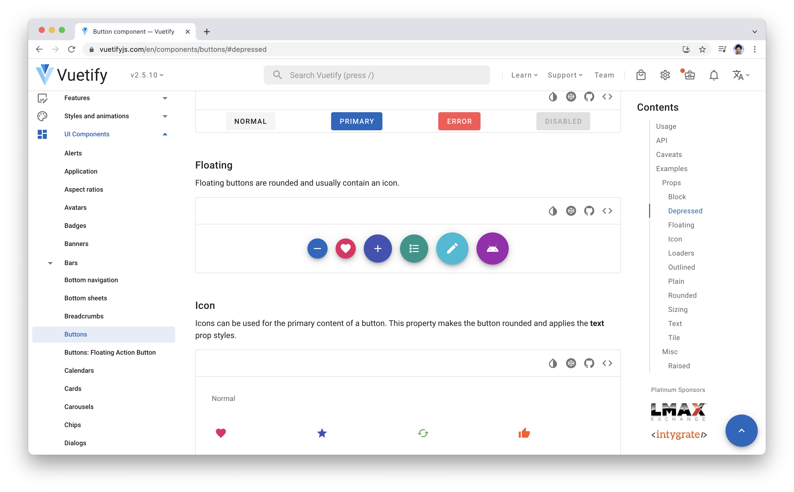

# Vuetify
Trame wraps Vuetify as it's primary UI Component Library. We encourage Trame developers to consult [Vuetify's website](https://vuetifyjs.com/en/) for API documentation, usage, and examples.

[](https://vuetifyjs.com/en/)

## Evaluating properties
Trame evaluates properties if they are wrapped in a tuple.
```python
from trame.html import vuetify

# This sets the label to "myLabel"
vuetify.VTextField(label="myLabel")

# This evaluates "myLabel" in Trame's Shared State for a value to set
vuetify.VTextField(label=("myLabel",))

# This evaluates "myLabel", which was initially set to "Initial Label"
vuetify.VTextField(label=("myLabel", "Initial Label"))
```

## Syntax changes
Wrapping Vuetify with Python was accomplished by making these syntax changes.
```python
from trame.html import vuetify

#----------------------------------------------------------------------
# Explicit boolean properties
#----------------------------------------------------------------------

# <v-text-field disabled />
vuetify.VTextField(disabled=True)

#----------------------------------------------------------------------
# Property name changes ('-' and ':' became '_' )
#----------------------------------------------------------------------

# <v-text-field v-model="myText" />
vuetify.VTextField(v_model=("myText",))

#----------------------------------------------------------------------
# Events (@ => nothing)
#----------------------------------------------------------------------

# <v-btn @click="runMethod" />
vuetify.VBtn(click=runMethod)

```
